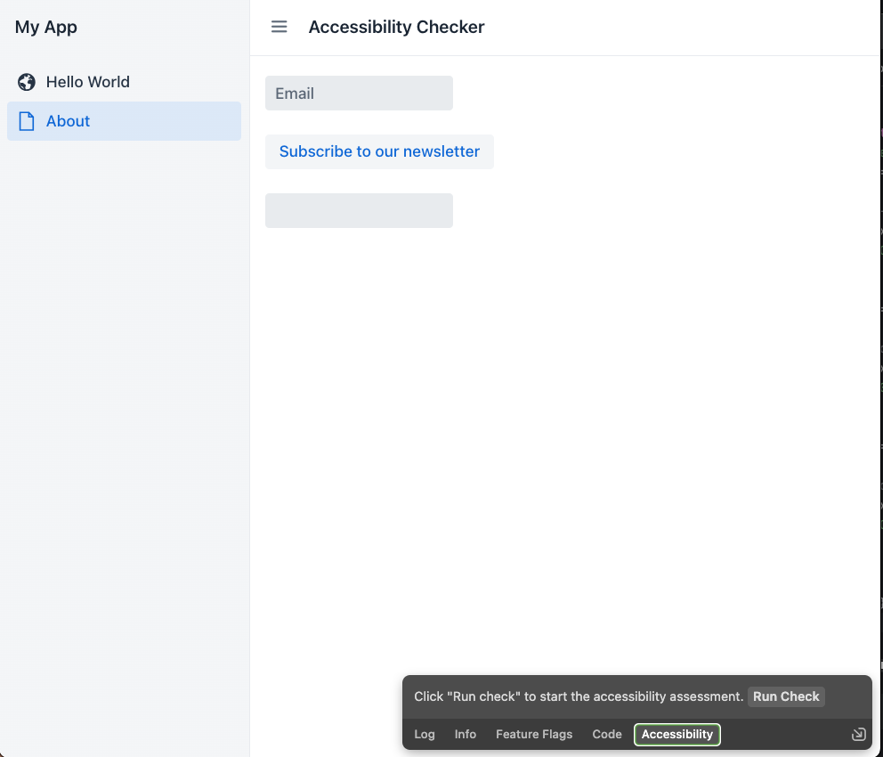
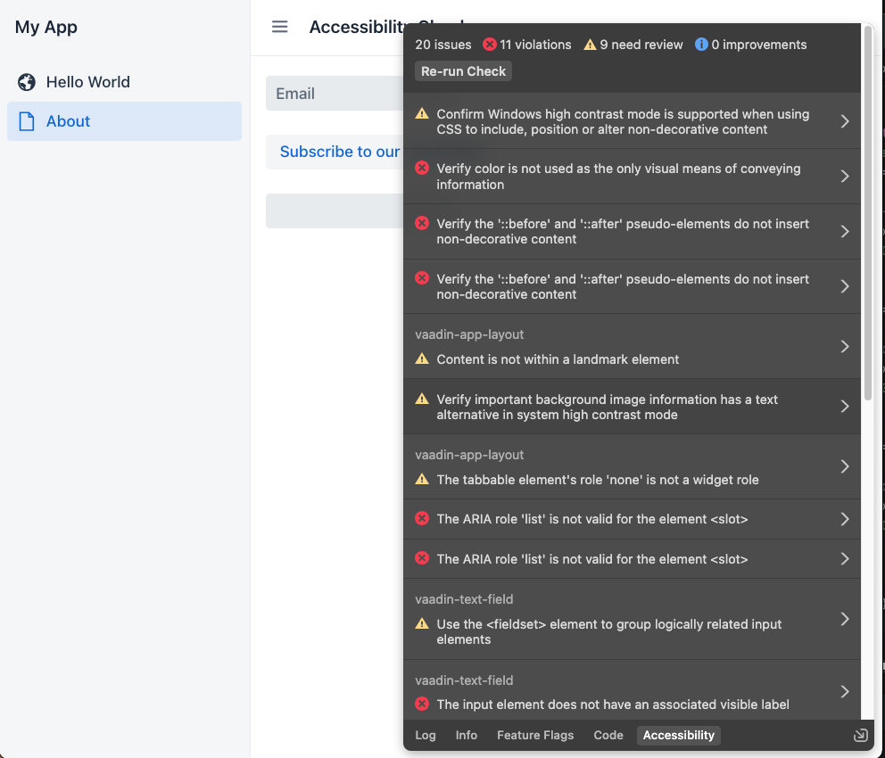
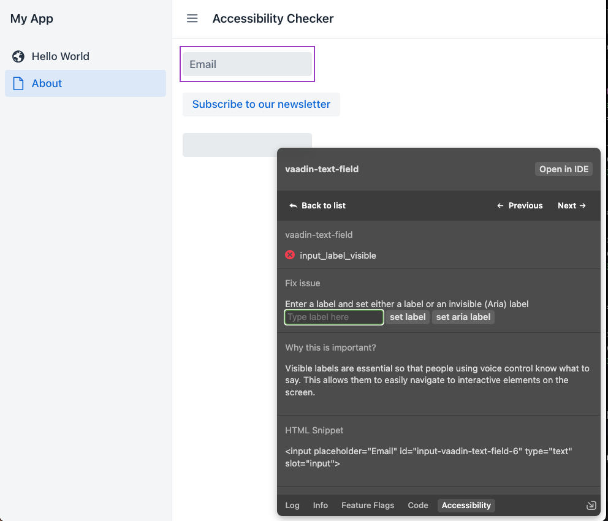
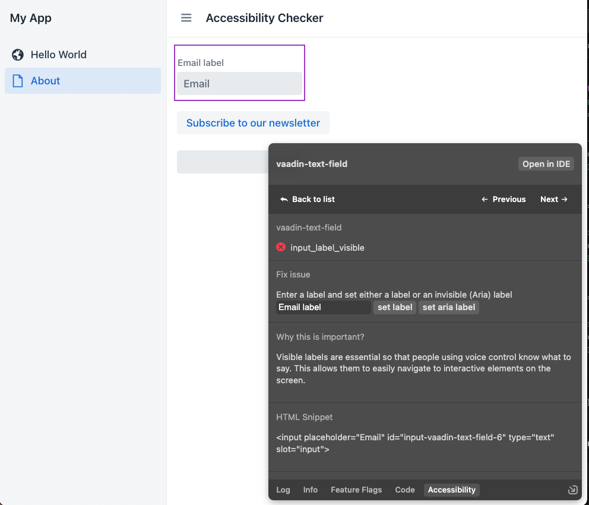

# Accessibility checker demo

You can try the accessibility checker on any Vaadin application.

It has been tested with Vaadin 24.1.

In your Vaadin application you need to add:
- A Javascript package in your application: `@JavaScript("https://unpkg.com/accessibility-checker-engine@latest/ace.js")`
- A configuration `vaadin.frontend.hotdeploy=true` in your application.properties for a Spring Boot application

You need to run the application.

Then you need to pull the vaadin/flow project on git (branch dev-tools/accessibility)
https://github.com/vaadin/flow/tree/dev-tools/accessibility

In this project, you need to go to the vaadin-dev-tools folder and run:
-  `npm install`
-  `npm run patch-app  /Users/xxx/Documents/devtools-accessibility-demo` (with the absolute path or the relative path of your Vaadin project)
-  `npm start`

Every time you are restarting your demo application you need to apply the patch.

## Screenshots

